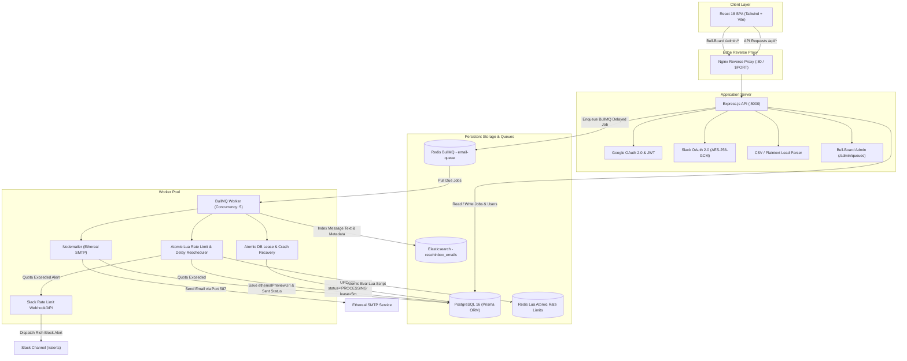

# ReachInbox Outbox — Production Email Scheduling & Rate Limiting Platform

[](https://www.typescriptlang.org/)
[](https://react.dev/)
[](https://tailwindcss.com/)
[](https://nodejs.org/)
[](https://expressjs.com/)
[](https://www.postgresql.org/)
[](https://bullmq.io/)
[](https://www.elastic.co/)
[-brightgreen.svg)]()
[](https://railway.app)
[](https://opensource.org/licenses/MIT)

A resilient, production-grade distributed email scheduling and dispatch platform built for the **ReachInbox Hiring Assignment**. Engineered with zero cron jobs, authentic Google OAuth 2.0, Slack OAuth 2.0 with AES-256-GCM token encryption, Redis-backed BullMQ delayed queues, atomic Redis Lua rate-limiting, distributed crash-recovery leases, Elasticsearch fuzzy search, and real Ethereal SMTP delivery.

---

## 🌐 Live Production Deployments & Quick Links

| Service | Environment / URL | Status | Description |
| :--- | :--- | :---: | :--- |
| **Frontend App** | [frontend-production-308d.up.railway.app](https://frontend-production-308d.up.railway.app) | 🟢 Live | Single Page Application (React + Vite + Nginx) |
| **Backend REST API** | [web-production-357f4.up.railway.app](https://web-production-357f4.up.railway.app) | 🟢 Live | Express API Server + Distributed Reconciler |
| **Bull-Board Queue UI** | [frontend-production-308d.up.railway.app/admin/queues](https://frontend-production-308d.up.railway.app/admin/queues) | 🟢 Live | Live BullMQ delayed job & queue monitor |
| **System Health** | [web-production-357f4.up.railway.app/health](https://web-production-357f4.up.railway.app/health) | 🟢 Live | Container health check endpoint |
| **SMTP Probe** | [web-production-357f4.up.railway.app/ready/smtp](https://web-production-357f4.up.railway.app/ready/smtp) | 🟢 Live | Outbound SMTP connection diagnostic check |
| **GitHub Repository** | [github.com/balaji-mali26/reachinbox-email-scheduler](https://github.com/balaji-mali26/reachinbox-email-scheduler) | 🟢 Active | Complete source code, Dockerfiles, and tests |

---

## 📐 System Architecture



---

## ⚡ Core Engineering Decisions & Guarantees

### 1. Zero Cron Architecture
Scheduling uses **BullMQ delayed jobs** backed by Redis. When an email or batch is submitted, the backend calculates the exact millisecond offset (`delay = scheduledAt - now`) and enqueues a persistent delayed job in Redis. There are zero OS cron jobs, `node-cron` packages, or polling `setInterval` timers in the scheduling pipeline.

### 2. Atomic Lua Rate Limiting & Spacing
Rate limits are strictly enforced at the worker execution layer using an **atomic Redis Lua script** (`src/services/rateLimiter.ts`). Under high concurrency, workers atomically check:
- **Hourly Window Quota**: `rate:sender:{senderId}:{YYYY-MM-DD-HH}` against the sender's hourly limit.
- **Inter-Email Spacing**: `rate:sender:{senderId}:last_sent` to guarantee that consecutive emails from the same sender are spaced by at least `minDelayMs` (e.g. 2000ms).
- **No Race Conditions**: Because Redis executes Lua scripts atomically, concurrent worker threads cannot over-allocate quotas or send emails faster than the configured spacing.

### 3. Automatic Rescheduling on Rate Limit Breach
When a sender's hourly quota is reached:
1. The job is marked with status `RATE_LIMITED_RESCHEDULED`.
2. The remaining delay to the start of the next hour window (`nextWindowStart - now`) is computed.
3. The job is automatically re-enqueued with BullMQ for the next window without dropping data.
4. An alert payload is queued for Slack notification with a 5-minute debounce lock to prevent spam.

### 4. Distributed Worker Crash Recovery & DB Leases
- Each claimed job transitions to `PROCESSING` with a 5-minute lease timestamp (`leaseExpiresAt`).
- A single-owner distributed lock (`lock:reconcile`) runs on startup to detect any stalled or orphaned jobs whose lease expired (e.g. if a worker container crashed mid-execution).
- Orphaned jobs are safely re-enqueued into BullMQ with zero data loss or duplicate delivery.

### 5. Multi-Tenant Dual Search Engine (Elasticsearch + Postgres Fallback)
- Outbound emails are indexed into Elasticsearch (`reachinbox_emails` index) with edge n-gram analyzers for fuzzy matching across recipients, subject lines, and email bodies.
- If Elasticsearch becomes unreachable, the search service (`src/services/searchService.ts`) automatically and transparently falls back to a PostgreSQL `ILIKE` search query with zero downtime.

### 6. Authentic OAuth 2.0 (Zero Mocks)
- **Google OAuth 2.0**: Implements full authorization code grant with CSRF state protection, generating signed, HTTP-only, secure session cookies.
- **Slack OAuth 2.0**: Completes the OAuth flow, encrypts bot access tokens using **AES-256-GCM** with unique initialization vectors (IVs) and authentication tags, and allows users to choose their alert channel from live workspace data.

---

## 🔗 OAuth 2.0 & Redirect URI Configuration

To ensure seamless OAuth integration across environments, the redirect URIs are configured as follows:

### 1. Google OAuth 2.0
- **Google Cloud Console Settings**:
  - **Authorized JavaScript Origins**:
    - Local: `http://localhost:5173`, `http://localhost:5000`
    - Production: `https://frontend-production-308d.up.railway.app`, `https://web-production-357f4.up.railway.app`
  - **Authorized Redirect URIs**:
    - Local: `http://localhost:5000/api/auth/google/callback`
    - Production: `https://web-production-357f4.up.railway.app/api/auth/google/callback`

### 2. Slack OAuth 2.0
- **Slack API Dashboard Settings** (under **OAuth & Permissions**):
  - **Redirect URLs**:
    - Local: `http://localhost:5000/api/slack/callback`
    - Production: `https://web-production-357f4.up.railway.app/api/slack/callback`
  - **Bot Token Scopes Required**:
    - `chat:write` — to send rate-limit alerts
    - `channels:read` — to list public channels for the channel selector
    - `groups:read` — to list private channels the bot is invited to
    - `incoming-webhook` — for webhook backup notifications

---

## 📂 Repository Structure

```text
reachinbox-email-scheduler/
├── backend/                       # Express + TypeScript Backend & Worker
│   ├── prisma/                    # PostgreSQL Schema & Migrations
│   │   ├── schema.prisma          # Database schema (User, EmailJob, SlackConnection, etc.)
│   │   └── migrations/            # Version-controlled SQL migrations
│   ├── src/
│   │   ├── config/                # Environment, Redis & logger configurations
│   │   ├── controllers/           # HTTP Request Controllers (auth, email, slack)
│   │   ├── middleware/            # JWT authentication & validation middleware
│   │   ├── routes/                # Express Route declarations (/api/auth, /api/emails, /api/slack)
│   │   ├── services/              # Core business logic:
│   │   │   ├── emailService.ts    # Job scheduling, batching, DB persistence
│   │   │   ├── queueService.ts    # BullMQ queue init, delay calculation & reconciliation
│   │   │   ├── rateLimiter.ts     # Atomic Redis Lua rate limiting & spacing
│   │   │   ├── emailSender.ts     # Nodemailer / Ethereal SMTP delivery
│   │   │   ├── slackService.ts    # Slack OAuth, channel listing & rich alert dispatch
│   │   │   ├── searchService.ts   # Elasticsearch fuzzy search with Postgres fallback
│   │   │   └── crypto.ts          # AES-256-GCM encryption for credentials
│   │   ├── workers/               # BullMQ Worker implementation
│   │   │   └── emailWorker.ts     # Job consumption, leasing, delivery & retries
│   │   ├── app.ts                 # Express application initialization & middleware
│   │   ├── server.ts              # API server startup & Bull-Board mounting
│   │   └── worker.ts              # Standalone worker pool entry point
│   ├── tests/                     # 10 Test Suites (Unit, Concurrency, Recovery, Fallback)
│   ├── Dockerfile.api             # Production Dockerfile for Web API
│   ├── Dockerfile.worker          # Production Dockerfile for BullMQ Worker
│   └── package.json
├── frontend/                      # React 18 + TypeScript + Tailwind CSS Frontend
│   ├── src/
│   │   ├── components/            # Reusable UI components:
│   │   │   ├── ComposeEmailView.tsx # Campaign composer with CSV parser & presets
│   │   │   ├── EmailDetail.tsx    # Email viewer with live Ethereal links & status
│   │   │   ├── SlackModal.tsx     # Slack OAuth connection & channel selector
│   │   │   └── Toast.tsx          # Lightweight feedback toast notification
│   │   ├── context/               # AuthContext (Google OAuth & session state)
│   │   ├── pages/                 # Full-page views:
│   │   │   ├── Dashboard.tsx      # Main dashboard (Scheduled / Sent / Search)
│   │   │   └── Login.tsx          # Google & Email Login screen
│   │   ├── services/              # Axios API client with unified error handling
│   │   ├── types/                 # TypeScript interfaces and response schemas
│   │   └── App.tsx                # Client-side router configuration
│   ├── nginx.conf                 # Production Nginx reverse-proxy configuration
│   ├── Dockerfile.frontend        # Production Multi-Stage Nginx Dockerfile
│   └── package.json
├── docker-compose.yml             # Local PostgreSQL, Redis, Elasticsearch stack
├── .env.example                   # Master environment template
└── README.md                      # Comprehensive documentation
```

---

## 🚀 Quick Start Guide (Local Setup)

### 1. Prerequisites
- **Node.js**: v18.x or v20.x
- **Docker & Docker Compose**: installed and running

### 2. Clone the Repository
```bash
git clone https://github.com/balaji-mali26/reachinbox-email-scheduler.git
cd reachinbox-email-scheduler
```

### 3. Start Local Infrastructure
Launch PostgreSQL, Redis, and Elasticsearch in Docker:
```bash
docker compose up -d
```
Verified services:
- **PostgreSQL**: `localhost:5432` (`user: postgres`, `password: postgres`, `db: reachinbox`)
- **Redis**: `localhost:6379`
- **Elasticsearch**: `localhost:9200`

### 4. Setup & Start Backend API
```bash
cd backend
npm install
cp .env.example .env
npx prisma db push
npm run dev
```
- API Server: `http://localhost:5000`
- Bull-Board Queue Dashboard: `http://localhost:5000/admin/queues`
- Health check: `http://localhost:5000/health`

### 5. Start the BullMQ Worker Service
In a separate terminal:
```bash
cd backend
npm run worker
```
The worker connects to Redis, starts processing scheduled BullMQ jobs, enforces rate limits, sends emails via Ethereal SMTP, and indexes them into Elasticsearch.

### 6. Setup & Start Frontend Application
In a third terminal:
```bash
cd frontend
npm install
npm run dev
```
Open **`http://localhost:5173`** in your browser.

---

## 🧪 Automated Testing Suite

All 10 test suites (32 unit, concurrency, rate limiting, and recovery tests) run in-band:

```bash
cd backend
npm test
```

### Test Coverage Highlights:
- `tests/unit/concurrency.test.ts` — Verifies quota enforcement under concurrent worker requests.
- `tests/unit/rateLimiter.test.ts` — Tests atomic Redis Lua hourly windows and reschedule delay calculations.
- `tests/unit/csvParser.test.ts` — Tests single-column, multi-column, and plain-text recipient parsing with deduplication.
- `tests/unit/crypto.test.ts` — Tests AES-256-GCM encryption, decryption, and authentication tag tampering detection.
- `tests/unit/searchService.test.ts` — Verifies Elasticsearch querying and automatic fallback to PostgreSQL.
- `tests/unit/schedulingCalculator.test.ts` — Verifies staggered BullMQ delays and past-time clamping.

```text
PASS tests/unit/concurrency.test.ts
PASS tests/unit/searchService.test.ts
PASS tests/unit/crypto.test.ts
PASS tests/unit/rateLimiter.test.ts
PASS tests/unit/csvParser.test.ts
PASS tests/unit/schedulingCalculator.test.ts
...
Test Suites: 10 passed, 10 total
Tests:       32 passed, 32 total
Snapshots:   0 total
```

---

## 📡 API Reference

### Authentication (`/api/auth`)
| Method | Endpoint | Description |
| :--- | :--- | :--- |
| `GET` | `/api/auth/google` | Initiates Google OAuth 2.0 authorization code flow |
| `GET` | `/api/auth/google/callback` | Google OAuth callback; sets HTTP-only session cookie |
| `POST` | `/api/auth/login` | Email/password sign-in |
| `GET` | `/api/auth/me` | Returns current authenticated user |
| `POST` | `/api/auth/logout` | Clears authentication cookie |

### Email Scheduling & Leads (`/api/emails`)
| Method | Endpoint | Description |
| :--- | :--- | :--- |
| `POST` | `/api/emails/schedule` | Validates and schedules email campaign with BullMQ |
| `POST` | `/api/emails/leads/parse` | Parses raw CSV or text leads, validates & deduplicates |
| `GET` | `/api/emails/scheduled` | Returns paginated list of scheduled emails |
| `GET` | `/api/emails/sent` | Returns paginated list of sent emails with Ethereal preview URLs |
| `GET` | `/api/emails/search?q=...` | Fuzzy multi-match search (Elasticsearch / Postgres fallback) |
| `GET` | `/api/emails/:id` | Returns single email job details |

### Slack Integration (`/api/slack`)
| Method | Endpoint | Description |
| :--- | :--- | :--- |
| `GET` | `/api/slack/connect` | Initiates Slack OAuth 2.0 flow |
| `GET` | `/api/slack/callback` | Slack OAuth callback; encrypts tokens via AES-256-GCM |
| `GET` | `/api/slack/channels` | Fetches available channels from connected Slack workspace |
| `POST` | `/api/slack/select-channel`| Persists selected alert channel |
| `POST` | `/api/slack/disconnect` | Disconnects Slack integration |

---

## 🚢 Production Deployment Architecture (Railway)

The production stack is deployed across 5 dedicated services on Railway:

1. **PostgreSQL Service**: Railway managed PostgreSQL 16 database.
2. **Redis Service**: Railway managed Redis instance connected via `redis.railway.internal:6379`.
3. **Web API Service (`Dockerfile.api`)**: Runs Express REST API, auth controllers, and distributed startup reconciler.
4. **Worker Service (`Dockerfile.worker`)**: Independent BullMQ worker container with concurrency of 5.
5. **Frontend Service (`Dockerfile.frontend`)**: Multi-stage build producing static assets served by Nginx, reverse-proxying `/api` and `/admin` requests.

---

## 📄 License

This project is licensed under the MIT License — see the [LICENSE](LICENSE) file for details.
